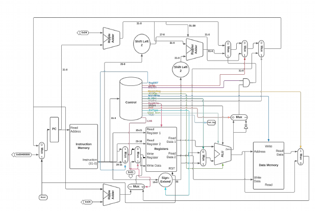

# Multi-Cycle and Pipelined MIPS Processor (VHDL)

This project includes both single-cycle and pipelined (multi-cycle) implementations of a MIPS-like processor written in VHDL. Developed as part of a computer architecture course, the design simulates instruction fetch, decode, execute, memory access, and write-back stages. Testbenches are included for verification and timing analysis.

In addition to architectural accuracy, this project was designed with **secure processor architecture principles** in mind. This ensures every control path and memory access adheres to foundational best practices in hardware trust boundaries, input validation, and error isolation.

## Architecture Diagram

## Features

- Modular, secure control and datapath separation  
- ALU supporting standard arithmetic and logic operations  
- Register file with read/write control  
- Separate single-cycle and pipelined implementations  
- Simulated instruction and data memory  
- VHDL testbenches covering key instruction classes  
- **Built with principles of secure-by-design system engineering**  

## Security-Focused Design Elements

- **Memory Isolation Simulation**: Memory modules were implemented with strict address control to simulate boundary enforcement and mitigate unintended read/write behaviors.
- **Control Flow Integrity (CFI)**: The control unit was carefully designed to prevent unintended execution branching, modeling core ideas behind CFI as seen in modern processor defenses.
- **Hazard Management = Attack Surface Reduction**: The pipelined design includes hazard detection, which was approached as a vector for race condition mitigation and speculative execution concerns (e.g., modeled analogs to Spectre-style behaviors).
- **Minimal Trusted Computing Base (TCB)**: All control signals and instruction paths were minimized to only necessary permissions; following least privilege principles in hardware-level access.

These secure design practices reflect the foundation of **cybersecurity-aware hardware development**, where understanding system internals is key to defending them.

## Implementations

### Single-Cycle Processor

Executes one instruction per clock cycle. This version provides a clean baseline for functional correctness and instruction integrity.

- All stages complete in one cycle  
- Basic control logic  
- Useful for baseline security and logic verification  
- Located in `Single-cycle MIPS Processor.zip`

### Pipelined (Multi-Cycle) Processor

Implements a standard 5-stage pipeline: Instruction Fetch (IF), Decode (ID), Execute (EX), Memory (MEM), and Write-Back (WB). Introduces parallelism and real-world processor behaviors.

- Instruction-level parallelism  
- Hazard detection and forwarding logic  
- Timing-based testing for execution accuracy  
- Located in `Multi-Cycle MIPs Processor.zip`

## Repository Structure

├── Single-cycle MIPS Processor.zip/ # Single-cycle processor implementation and testbenches
├── Multi-Cycle MIPs Processor.zip/ # Pipelined (multi-cycle) processor implementation and testbenches
├── images/ # Block diagram and architectural illustrations
├── LICENSE # MIT License
└── README.md # Project documentation

markdown
Copy
Edit

## Tools Used

- VHDL – For hardware behavior modeling  
- ModelSim – For simulation and waveform analysis  
- GitHub – For version control and professional portfolio visibility  

## License

This project is licensed under the [MIT License](LICENSE).

## Author

**Grant Pierce**  
B.S. Cybersecurity Engineering  
Iowa State University  
Security-Conscious Systems Designer
GitHub: [@GrantPierce94](https://github.com/GrantPierce94)
